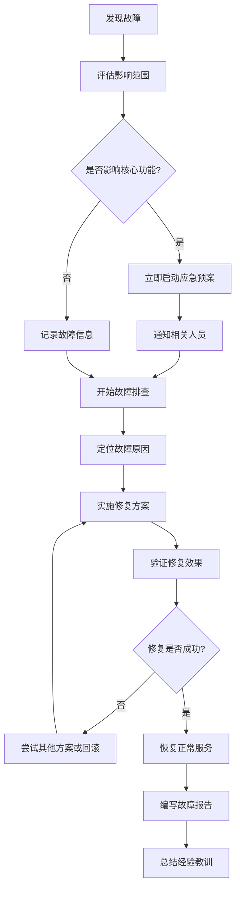

# Lawsker 系统运维手册

## 概述

本手册为 Lawsker 系统的日常运维提供详细指导，包括监控、维护、故障处理和性能优化等方面的操作说明。

## 目录

1. [系统架构概览](#系统架构概览)
2. [日常监控](#日常监控)
3. [维护任务](#维护任务)
4. [故障处理](#故障处理)
5. [性能优化](#性能优化)
6. [备份和恢复](#备份和恢复)
7. [安全管理](#安全管理)
8. [容量规划](#容量规划)

## 系统架构概览

### 组件架构

```
┌─────────────────┐    ┌─────────────────┐    ┌─────────────────┐
│   Load Balancer │    │     Nginx       │    │   Frontend      │
│   (Cloudflare)  │────│   (Reverse      │────│   (Static       │
│                 │    │    Proxy)       │    │    Files)       │
└─────────────────┘    └─────────────────┘    └─────────────────┘
                                │
                                ▼
                       ┌─────────────────┐
                       │   Backend API   │
                       │   (FastAPI +    │
                       │    Uvicorn)     │
                       └─────────────────┘
                                │
                    ┌───────────┼───────────┐
                    ▼           ▼           ▼
            ┌─────────────┐ ┌─────────┐ ┌─────────┐
            │ PostgreSQL  │ │  Redis  │ │  Files  │
            │ (Database)  │ │ (Cache) │ │(Storage)│
            └─────────────┘ └─────────┘ └─────────┘
```

### 服务端口分配

| 服务 | 端口 | 协议 | 描述 |
|------|------|------|------|
| Nginx | 80, 443 | HTTP/HTTPS | Web 服务器 |
| Backend API | 8000 | HTTP | 后端 API 服务 |
| PostgreSQL | 5432 | TCP | 数据库服务 |
| Redis | 6379 | TCP | 缓存服务 |
| Prometheus | 9090 | HTTP | 监控数据收集 |
| Grafana | 3000 | HTTP | 监控仪表板 |

## 日常监控

### 1. 系统健康检查

#### 自动化健康检查脚本

```bash
#!/bin/bash
# health_check.sh - 系统健康检查脚本

echo "=== Lawsker 系统健康检查 $(date) ==="

# 检查服务状态
services=("nginx" "lawsker-backend" "postgresql" "redis" "prometheus" "grafana-server")
for service in "${services[@]}"; do
    if systemctl is-active --quiet "$service"; then
        echo "✓ $service: 运行中"
    else
        echo "✗ $service: 停止"
    fi
done

# 检查端口监听
ports=("80" "443" "8000" "5432" "6379" "9090" "3000")
for port in "${ports[@]}"; do
    if netstat -tlnp | grep -q ":$port "; then
        echo "✓ 端口 $port: 监听中"
    else
        echo "✗ 端口 $port: 未监听"
    fi
done

# 检查磁盘空间
echo ""
echo "=== 磁盘使用情况 ==="
df -h | awk '$5 > 80 {print "⚠ " $1 " 使用率: " $5}' || echo "✓ 磁盘空间充足"

# 检查内存使用
echo ""
echo "=== 内存使用情况 ==="
free -h | awk 'NR==2{printf "内存使用: %s/%s (%.2f%%)\n", $3,$2,$3*100/$2}'

# 检查 CPU 负载
echo ""
echo "=== CPU 负载 ==="
uptime | awk '{print "负载平均值: " $(NF-2) " " $(NF-1) " " $NF}'

# 检查应用健康
echo ""
echo "=== 应用健康检查 ==="
if curl -sf http://localhost:8000/api/v1/health > /dev/null; then
    echo "✓ 后端 API: 正常"
else
    echo "✗ 后端 API: 异常"
fi

if curl -sf https://lawsker.com > /dev/null; then
    echo "✓ 前端页面: 正常"
else
    echo "✗ 前端页面: 异常"
fi

echo ""
echo "=== 检查完成 ==="
```

#### 设置定时检查

```bash
# 添加到 crontab
crontab -e

# 每5分钟执行一次健康检查
*/5 * * * * /opt/lawsker/scripts/health_check.sh >> /var/log/lawsker/health_check.log 2>&1
```

### 2. 监控指标

#### 关键性能指标 (KPI)

| 指标类别 | 指标名称 | 正常范围 | 告警阈值 |
|----------|----------|----------|----------|
| 响应时间 | API 响应时间 | < 500ms | > 1000ms |
| 吞吐量 | 每秒请求数 | > 10 RPS | < 5 RPS |
| 错误率 | HTTP 5xx 错误率 | < 1% | > 5% |
| 系统资源 | CPU 使用率 | < 70% | > 85% |
| 系统资源 | 内存使用率 | < 80% | > 90% |
| 系统资源 | 磁盘使用率 | < 80% | > 90% |
| 数据库 | 连接数 | < 50 | > 80 |
| 数据库 | 查询时间 | < 100ms | > 500ms |

#### Prometheus 查询语句

```promql
# API 响应时间 P95
histogram_quantile(0.95, rate(http_request_duration_seconds_bucket[5m]))

# 错误率
rate(http_requests_total{status=~"5.."}[5m]) / rate(http_requests_total[5m]) * 100

# CPU 使用率
100 - (avg by(instance) (rate(node_cpu_seconds_total{mode="idle"}[5m])) * 100)

# 内存使用率
(1 - (node_memory_MemAvailable_bytes / node_memory_MemTotal_bytes)) * 100

# 数据库连接数
pg_stat_database_numbackends{datname="lawsker_prod"}

# 磁盘使用率
(1 - (node_filesystem_avail_bytes / node_filesystem_size_bytes)) * 100
```

### 3. 日志监控

#### 日志文件位置

```bash
# 应用日志
/var/log/lawsker/app.log
/var/log/lawsker/error.log
/var/log/lawsker/access.log

# 系统服务日志
/var/log/nginx/access.log
/var/log/nginx/error.log
/var/log/postgresql/postgresql-12-main.log
/var/log/redis/redis-server.log

# 系统日志
/var/log/syslog
/var/log/auth.log
```

#### 日志监控脚本

```bash
#!/bin/bash
# log_monitor.sh - 日志监控脚本

# 检查错误日志
echo "=== 最近的错误日志 ==="
tail -n 50 /var/log/lawsker/error.log | grep -i error | tail -n 10

# 检查 Nginx 错误
echo ""
echo "=== Nginx 错误日志 ==="
tail -n 50 /var/log/nginx/error.log | tail -n 10

# 检查数据库错误
echo ""
echo "=== PostgreSQL 错误日志 ==="
tail -n 50 /var/log/postgresql/postgresql-12-main.log | grep -i error | tail -n 10

# 统计访问量
echo ""
echo "=== 今日访问统计 ==="
today=$(date +%d/%b/%Y)
grep "$today" /var/log/nginx/access.log | wc -l | awk '{print "今日访问量: " $1}'

# 统计错误请求
echo ""
echo "=== 今日错误请求统计 ==="
grep "$today" /var/log/nginx/access.log | grep -E " (4[0-9][0-9]|5[0-9][0-9]) " | wc -l | awk '{print "今日错误请求: " $1}'
```

## 维护任务

### 1. 日常维护

#### 每日维护清单

```bash
#!/bin/bash
# daily_maintenance.sh - 每日维护脚本

echo "=== 每日维护任务开始 $(date) ==="

# 1. 检查系统资源
echo "1. 检查系统资源..."
df -h | awk '$5 > 80 {print "警告: " $1 " 磁盘使用率 " $5}'
free -m | awk 'NR==2{printf "内存使用率: %.2f%%\n", $3*100/$2}'

# 2. 清理临时文件
echo "2. 清理临时文件..."
find /tmp -type f -atime +7 -delete
find /var/tmp -type f -atime +7 -delete

# 3. 轮转日志文件
echo "3. 轮转日志文件..."
logrotate -f /etc/logrotate.d/lawsker

# 4. 检查服务状态
echo "4. 检查服务状态..."
systemctl status lawsker-backend --no-pager -l
systemctl status nginx --no-pager -l
systemctl status postgresql --no-pager -l

# 5. 数据库维护
echo "5. 数据库维护..."
sudo -u postgres psql -d lawsker_prod -c "SELECT pg_size_pretty(pg_database_size('lawsker_prod'));"
sudo -u postgres psql -d lawsker_prod -c "VACUUM ANALYZE;"

# 6. 检查 SSL 证书
echo "6. 检查 SSL 证书..."
cert_expiry=$(openssl s_client -connect lawsker.com:443 -servername lawsker.com < /dev/null 2>/dev/null | openssl x509 -noout -enddate | cut -d= -f2)
echo "SSL 证书到期时间: $cert_expiry"

echo "=== 每日维护任务完成 $(date) ==="
```

#### 每周维护清单

```bash
#!/bin/bash
# weekly_maintenance.sh - 每周维护脚本

echo "=== 每周维护任务开始 $(date) ==="

# 1. 系统更新检查
echo "1. 检查系统更新..."
apt list --upgradable 2>/dev/null | grep -v "WARNING" | wc -l | awk '{print "可更新包数量: " $1}'

# 2. 数据库备份
echo "2. 执行数据库备份..."
backup_file="/backup/lawsker_weekly_$(date +%Y%m%d).sql.gz"
pg_dump -h localhost -U lawsker_user lawsker_prod | gzip > "$backup_file"
echo "备份文件: $backup_file"

# 3. 清理旧备份
echo "3. 清理旧备份文件..."
find /backup -name "lawsker_*.sql.gz" -mtime +30 -delete
echo "已清理30天前的备份文件"

# 4. 性能分析
echo "4. 数据库性能分析..."
sudo -u postgres psql -d lawsker_prod -c "
SELECT schemaname, tablename, n_tup_ins, n_tup_upd, n_tup_del 
FROM pg_stat_user_tables 
ORDER BY n_tup_ins + n_tup_upd + n_tup_del DESC 
LIMIT 10;"

# 5. 检查磁盘 I/O
echo "5. 检查磁盘 I/O..."
iostat -x 1 3 | tail -n +4

# 6. 网络连接统计
echo "6. 网络连接统计..."
netstat -an | awk '/^tcp/ {print $6}' | sort | uniq -c | sort -nr

echo "=== 每周维护任务完成 $(date) ==="
```

### 2. 自动化维护

#### 设置 Cron 任务

```bash
# 编辑 crontab
sudo crontab -e

# 添加维护任务
# 每日凌晨2点执行日常维护
0 2 * * * /opt/lawsker/scripts/daily_maintenance.sh >> /var/log/lawsker/maintenance.log 2>&1

# 每周日凌晨3点执行周维护
0 3 * * 0 /opt/lawsker/scripts/weekly_maintenance.sh >> /var/log/lawsker/maintenance.log 2>&1

# 每小时检查一次健康状态
0 * * * * /opt/lawsker/scripts/health_check.sh >> /var/log/lawsker/health.log 2>&1

# 每天检查日志
0 1 * * * /opt/lawsker/scripts/log_monitor.sh >> /var/log/lawsker/log_monitor.log 2>&1
```

## 故障处理

### 1. 常见故障诊断

#### 服务无响应

**症状**: 网站无法访问或响应缓慢

**诊断步骤**:

```bash
# 1. 检查服务状态
systemctl status nginx
systemctl status lawsker-backend

# 2. 检查端口监听
netstat -tlnp | grep -E ':(80|443|8000)'

# 3. 检查进程
ps aux | grep -E '(nginx|uvicorn)'

# 4. 检查系统资源
top
free -h
df -h

# 5. 检查网络连接
curl -I http://localhost:8000/api/v1/health
curl -I https://lawsker.com
```

**解决方案**:

```bash
# 重启相关服务
sudo systemctl restart nginx
sudo systemctl restart lawsker-backend

# 如果是资源不足
# 清理内存
echo 3 > /proc/sys/vm/drop_caches

# 清理磁盘空间
find /var/log -name "*.log" -mtime +7 -delete
```

#### 数据库连接问题

**症状**: 应用报告数据库连接错误

**诊断步骤**:

```bash
# 1. 检查 PostgreSQL 服务
systemctl status postgresql

# 2. 检查数据库连接
sudo -u postgres psql -c "\l"

# 3. 检查连接数
sudo -u postgres psql -d lawsker_prod -c "SELECT count(*) FROM pg_stat_activity;"

# 4. 检查锁等待
sudo -u postgres psql -d lawsker_prod -c "SELECT * FROM pg_locks WHERE NOT granted;"

# 5. 检查慢查询
sudo -u postgres psql -d lawsker_prod -c "SELECT query, state, query_start FROM pg_stat_activity WHERE state != 'idle';"
```

**解决方案**:

```bash
# 重启数据库服务
sudo systemctl restart postgresql

# 终止长时间运行的查询
sudo -u postgres psql -d lawsker_prod -c "SELECT pg_terminate_backend(pid) FROM pg_stat_activity WHERE state != 'idle' AND query_start < now() - interval '5 minutes';"

# 优化数据库配置
sudo -u postgres psql -d lawsker_prod -c "VACUUM ANALYZE;"
```

#### SSL 证书问题

**症状**: HTTPS 访问失败或证书警告

**诊断步骤**:

```bash
# 1. 检查证书文件
ls -la /etc/letsencrypt/live/lawsker.com/

# 2. 检查证书有效期
openssl x509 -in /etc/letsencrypt/live/lawsker.com/cert.pem -noout -dates

# 3. 测试 SSL 连接
openssl s_client -connect lawsker.com:443 -servername lawsker.com

# 4. 检查 Nginx 配置
nginx -t
```

**解决方案**:

```bash
# 续期证书
sudo certbot renew

# 重新申请证书
sudo certbot certonly --nginx -d lawsker.com -d www.lawsker.com

# 重启 Nginx
sudo systemctl restart nginx
```

### 2. 故障处理流程

#### 紧急故障处理



#### 故障等级定义

| 等级 | 定义 | 响应时间 | 解决时间 |
|------|------|----------|----------|
| P0 - 紧急 | 系统完全不可用 | 15分钟 | 2小时 |
| P1 - 高 | 核心功能受影响 | 30分钟 | 4小时 |
| P2 - 中 | 部分功能受影响 | 2小时 | 24小时 |
| P3 - 低 | 轻微影响或优化 | 1天 | 1周 |

### 3. 应急预案

#### 数据库故障应急预案

```bash
#!/bin/bash
# db_emergency.sh - 数据库故障应急脚本

echo "=== 数据库故障应急处理 $(date) ==="

# 1. 检查数据库状态
if ! systemctl is-active --quiet postgresql; then
    echo "数据库服务已停止，尝试重启..."
    systemctl start postgresql
    sleep 10
fi

# 2. 检查数据库连接
if ! sudo -u postgres psql -c "\l" > /dev/null 2>&1; then
    echo "数据库连接失败，检查配置..."
    # 检查配置文件
    sudo -u postgres pg_ctl status -D /var/lib/postgresql/12/main
fi

# 3. 如果数据库无法恢复，启用只读模式
if ! sudo -u postgres psql -d lawsker_prod -c "SELECT 1;" > /dev/null 2>&1; then
    echo "启用应用只读模式..."
    # 修改应用配置为只读模式
    sed -i 's/READ_ONLY=false/READ_ONLY=true/' /opt/lawsker/.env.production
    systemctl restart lawsker-backend
fi

echo "=== 应急处理完成 ==="
```

#### 服务器资源耗尽应急预案

```bash
#!/bin/bash
# resource_emergency.sh - 资源耗尽应急脚本

echo "=== 服务器资源应急处理 $(date) ==="

# 1. 检查磁盘空间
disk_usage=$(df / | awk 'NR==2 {print $5}' | sed 's/%//')
if [ "$disk_usage" -gt 90 ]; then
    echo "磁盘空间不足，开始清理..."
    # 清理日志文件
    find /var/log -name "*.log" -mtime +3 -delete
    # 清理临时文件
    find /tmp -type f -atime +1 -delete
    # 清理应用缓存
    rm -rf /opt/lawsker/backend/__pycache__/*
fi

# 2. 检查内存使用
mem_usage=$(free | awk 'NR==2{printf "%.0f", $3*100/$2}')
if [ "$mem_usage" -gt 90 ]; then
    echo "内存使用率过高，释放缓存..."
    echo 3 > /proc/sys/vm/drop_caches
    # 重启占用内存较多的服务
    systemctl restart lawsker-backend
fi

# 3. 检查 CPU 负载
load_avg=$(uptime | awk '{print $(NF-2)}' | sed 's/,//')
if (( $(echo "$load_avg > 4.0" | bc -l) )); then
    echo "CPU 负载过高，降低服务优先级..."
    # 降低后端服务优先级
    renice 10 $(pgrep -f uvicorn)
fi

echo "=== 资源应急处理完成 ==="
```

## 性能优化

### 1. 数据库性能优化

#### 查询优化

```sql
-- 查看慢查询
SELECT query, mean_time, calls, total_time
FROM pg_stat_statements
WHERE mean_time > 100
ORDER BY mean_time DESC
LIMIT 20;

-- 查看表统计信息
SELECT schemaname, tablename, n_tup_ins, n_tup_upd, n_tup_del, n_tup_hot_upd
FROM pg_stat_user_tables
ORDER BY n_tup_ins + n_tup_upd + n_tup_del DESC;

-- 查看索引使用情况
SELECT schemaname, tablename, indexname, idx_tup_read, idx_tup_fetch
FROM pg_stat_user_indexes
ORDER BY idx_tup_read DESC;

-- 查看未使用的索引
SELECT schemaname, tablename, indexname, idx_scan
FROM pg_stat_user_indexes
WHERE idx_scan = 0;
```

#### 索引优化

```sql
-- 创建复合索引
CREATE INDEX CONCURRENTLY idx_cases_user_status ON cases(user_id, status);
CREATE INDEX CONCURRENTLY idx_documents_case_type ON documents(case_id, document_type);

-- 创建部分索引
CREATE INDEX CONCURRENTLY idx_active_users ON users(id) WHERE status = 'active';

-- 创建表达式索引
CREATE INDEX CONCURRENTLY idx_users_email_lower ON users(lower(email));
```

#### 配置优化

```ini
# postgresql.conf 优化配置

# 内存配置
shared_buffers = 512MB                  # 25% of RAM
effective_cache_size = 1536MB           # 75% of RAM
work_mem = 8MB                          # Per connection
maintenance_work_mem = 128MB

# 检查点配置
checkpoint_completion_target = 0.9
checkpoint_timeout = 10min
max_wal_size = 2GB
min_wal_size = 1GB

# 连接配置
max_connections = 100
shared_preload_libraries = 'pg_stat_statements'

# 日志配置
log_min_duration_statement = 1000
log_checkpoints = on
log_connections = on
log_disconnections = on
log_lock_waits = on
```

### 2. 应用性能优化

#### 缓存策略

```python
# Redis 缓存配置
CACHE_CONFIG = {
    'default': {
        'BACKEND': 'django_redis.cache.RedisCache',
        'LOCATION': 'redis://127.0.0.1:6379/1',
        'OPTIONS': {
            'CLIENT_CLASS': 'django_redis.client.DefaultClient',
            'CONNECTION_POOL_KWARGS': {
                'max_connections': 50,
                'retry_on_timeout': True,
            }
        },
        'TIMEOUT': 300,
        'KEY_PREFIX': 'lawsker',
    }
}

# 缓存装饰器使用
from functools import wraps
import redis

redis_client = redis.Redis(host='localhost', port=6379, db=1)

def cache_result(timeout=300):
    def decorator(func):
        @wraps(func)
        def wrapper(*args, **kwargs):
            cache_key = f"{func.__name__}:{hash(str(args) + str(kwargs))}"
            cached_result = redis_client.get(cache_key)
            
            if cached_result:
                return json.loads(cached_result)
            
            result = func(*args, **kwargs)
            redis_client.setex(cache_key, timeout, json.dumps(result, default=str))
            return result
        return wrapper
    return decorator
```

#### 连接池优化

```python
# SQLAlchemy 连接池配置
from sqlalchemy import create_engine
from sqlalchemy.pool import QueuePool

engine = create_engine(
    DATABASE_URL,
    poolclass=QueuePool,
    pool_size=20,           # 连接池大小
    max_overflow=30,        # 最大溢出连接数
    pool_timeout=30,        # 获取连接超时时间
    pool_recycle=3600,      # 连接回收时间
    pool_pre_ping=True,     # 连接前检查
    echo=False
)
```

### 3. 系统性能优化

#### Nginx 优化

```nginx
# nginx.conf 性能优化配置

worker_processes auto;
worker_rlimit_nofile 65535;

events {
    worker_connections 4096;
    use epoll;
    multi_accept on;
}

http {
    # 基础优化
    sendfile on;
    tcp_nopush on;
    tcp_nodelay on;
    keepalive_timeout 65;
    keepalive_requests 1000;
    
    # 缓冲区优化
    client_body_buffer_size 128k;
    client_max_body_size 16m;
    client_header_buffer_size 1k;
    large_client_header_buffers 4 4k;
    output_buffers 1 32k;
    postpone_output 1460;
    
    # 压缩优化
    gzip on;
    gzip_vary on;
    gzip_min_length 1024;
    gzip_comp_level 6;
    gzip_types
        text/plain
        text/css
        text/xml
        text/javascript
        application/json
        application/javascript
        application/xml+rss
        application/atom+xml
        image/svg+xml;
    
    # 缓存优化
    open_file_cache max=200000 inactive=20s;
    open_file_cache_valid 30s;
    open_file_cache_min_uses 2;
    open_file_cache_errors on;
    
    # 上游服务器配置
    upstream backend {
        server 127.0.0.1:8000 weight=1 max_fails=3 fail_timeout=30s;
        keepalive 32;
    }
}
```

#### 系统内核优化

```bash
# /etc/sysctl.conf 系统优化配置

# 网络优化
net.core.somaxconn = 65535
net.core.netdev_max_backlog = 5000
net.ipv4.tcp_max_syn_backlog = 65535
net.ipv4.tcp_fin_timeout = 10
net.ipv4.tcp_keepalive_time = 1200
net.ipv4.tcp_max_tw_buckets = 5000

# 文件描述符限制
fs.file-max = 2097152
fs.nr_open = 2097152

# 内存优化
vm.swappiness = 10
vm.dirty_ratio = 15
vm.dirty_background_ratio = 5

# 应用配置
echo "* soft nofile 65535" >> /etc/security/limits.conf
echo "* hard nofile 65535" >> /etc/security/limits.conf
```

## 备份和恢复

### 1. 数据库备份策略

#### 自动备份脚本

```bash
#!/bin/bash
# backup_database.sh - 数据库备份脚本

BACKUP_DIR="/backup/database"
DATE=$(date +%Y%m%d_%H%M%S)
DB_NAME="lawsker_prod"
DB_USER="lawsker_user"

# 创建备份目录
mkdir -p "$BACKUP_DIR"

# 执行备份
echo "开始备份数据库 $DB_NAME..."
pg_dump -h localhost -U "$DB_USER" -d "$DB_NAME" | gzip > "$BACKUP_DIR/lawsker_$DATE.sql.gz"

if [ $? -eq 0 ]; then
    echo "数据库备份成功: $BACKUP_DIR/lawsker_$DATE.sql.gz"
    
    # 清理旧备份（保留30天）
    find "$BACKUP_DIR" -name "lawsker_*.sql.gz" -mtime +30 -delete
    echo "已清理30天前的备份文件"
    
    # 备份到远程存储（可选）
    # rsync -av "$BACKUP_DIR/lawsker_$DATE.sql.gz" user@backup-server:/backup/
    
else
    echo "数据库备份失败"
    exit 1
fi
```

#### 增量备份

```bash
#!/bin/bash
# incremental_backup.sh - 增量备份脚本

BACKUP_DIR="/backup/wal"
ARCHIVE_DIR="/backup/archive"

# 配置 PostgreSQL 归档
sudo -u postgres psql -c "ALTER SYSTEM SET archive_mode = on;"
sudo -u postgres psql -c "ALTER SYSTEM SET archive_command = 'cp %p $ARCHIVE_DIR/%f';"
sudo systemctl restart postgresql

# WAL 备份
mkdir -p "$BACKUP_DIR"
mkdir -p "$ARCHIVE_DIR"

# 执行基础备份
sudo -u postgres pg_basebackup -D "$BACKUP_DIR/base_$(date +%Y%m%d)" -Ft -z -P
```

### 2. 文件备份

```bash
#!/bin/bash
# backup_files.sh - 文件备份脚本

BACKUP_DIR="/backup/files"
DATE=$(date +%Y%m%d_%H%M%S)

# 备份应用文件
tar -czf "$BACKUP_DIR/lawsker_files_$DATE.tar.gz" \
    --exclude='*.log' \
    --exclude='__pycache__' \
    --exclude='node_modules' \
    --exclude='.git' \
    /opt/lawsker

# 备份配置文件
tar -czf "$BACKUP_DIR/config_$DATE.tar.gz" \
    /etc/nginx/sites-available/lawsker.conf \
    /etc/systemd/system/lawsker-backend.service \
    /opt/lawsker/.env.production

# 备份上传文件
tar -czf "$BACKUP_DIR/uploads_$DATE.tar.gz" /opt/lawsker/uploads

echo "文件备份完成"
```

### 3. 恢复流程

#### 数据库恢复

```bash
#!/bin/bash
# restore_database.sh - 数据库恢复脚本

BACKUP_FILE="$1"
DB_NAME="lawsker_prod"
DB_USER="lawsker_user"

if [ -z "$BACKUP_FILE" ]; then
    echo "用法: $0 <backup_file>"
    exit 1
fi

echo "开始恢复数据库..."

# 停止应用服务
systemctl stop lawsker-backend

# 删除现有数据库
sudo -u postgres psql -c "DROP DATABASE IF EXISTS $DB_NAME;"
sudo -u postgres psql -c "CREATE DATABASE $DB_NAME OWNER $DB_USER;"

# 恢复数据
if [[ "$BACKUP_FILE" == *.gz ]]; then
    gunzip -c "$BACKUP_FILE" | sudo -u postgres psql -d "$DB_NAME"
else
    sudo -u postgres psql -d "$DB_NAME" < "$BACKUP_FILE"
fi

if [ $? -eq 0 ]; then
    echo "数据库恢复成功"
    # 重启应用服务
    systemctl start lawsker-backend
else
    echo "数据库恢复失败"
    exit 1
fi
```

## 安全管理

### 1. 访问控制

#### SSH 安全配置

```bash
# /etc/ssh/sshd_config 安全配置

# 禁用 root 登录
PermitRootLogin no

# 使用密钥认证
PubkeyAuthentication yes
PasswordAuthentication no

# 限制登录用户
AllowUsers deploy admin

# 修改默认端口
Port 2222

# 限制登录尝试
MaxAuthTries 3
MaxStartups 3

# 启用日志
LogLevel VERBOSE
```

#### 防火墙配置

```bash
# UFW 防火墙配置
ufw --force reset
ufw default deny incoming
ufw default allow outgoing

# 允许必要端口
ufw allow 2222/tcp    # SSH
ufw allow 80/tcp      # HTTP
ufw allow 443/tcp     # HTTPS

# 限制访问监控端口
ufw allow from 10.0.0.0/8 to any port 9090  # Prometheus
ufw allow from 10.0.0.0/8 to any port 3000  # Grafana

# 启用防火墙
ufw --force enable
```

### 2. 安全监控

#### 入侵检测

```bash
#!/bin/bash
# security_monitor.sh - 安全监控脚本

echo "=== 安全监控检查 $(date) ==="

# 检查失败的登录尝试
echo "1. 检查失败的登录尝试..."
grep "Failed password" /var/log/auth.log | tail -n 10

# 检查 sudo 使用
echo "2. 检查 sudo 使用记录..."
grep "sudo:" /var/log/auth.log | tail -n 10

# 检查异常网络连接
echo "3. 检查异常网络连接..."
netstat -an | grep ESTABLISHED | awk '{print $5}' | cut -d: -f1 | sort | uniq -c | sort -nr | head -n 10

# 检查文件权限变更
echo "4. 检查关键文件权限..."
find /opt/lawsker -name "*.py" -perm /o+w -ls
find /etc -name "*.conf" -newer /tmp/last_check -ls 2>/dev/null

# 更新检查时间戳
touch /tmp/last_check

echo "=== 安全监控完成 ==="
```

#### 漏洞扫描

```bash
#!/bin/bash
# vulnerability_scan.sh - 漏洞扫描脚本

echo "=== 系统漏洞扫描 $(date) ==="

# 检查系统更新
echo "1. 检查安全更新..."
apt list --upgradable 2>/dev/null | grep -i security

# 检查开放端口
echo "2. 检查开放端口..."
nmap -sT -O localhost

# 检查 SSL 配置
echo "3. 检查 SSL 配置..."
testssl.sh --quiet lawsker.com

# 检查应用依赖漏洞
echo "4. 检查 Python 依赖漏洞..."
cd /opt/lawsker/backend
source venv/bin/activate
safety check

echo "=== 漏洞扫描完成 ==="
```

## 容量规划

### 1. 资源使用趋势分析

#### 监控数据收集

```bash
#!/bin/bash
# collect_metrics.sh - 资源使用数据收集

METRICS_FILE="/var/log/lawsker/metrics_$(date +%Y%m%d).log"

# 收集系统指标
{
    echo "timestamp,cpu_usage,memory_usage,disk_usage,network_in,network_out"
    
    while true; do
        timestamp=$(date +%s)
        cpu_usage=$(top -bn1 | grep "Cpu(s)" | awk '{print $2}' | sed 's/%us,//')
        memory_usage=$(free | awk 'NR==2{printf "%.2f", $3*100/$2}')
        disk_usage=$(df / | awk 'NR==2{print $5}' | sed 's/%//')
        network_stats=$(cat /proc/net/dev | grep eth0 | awk '{print $2","$10}')
        
        echo "$timestamp,$cpu_usage,$memory_usage,$disk_usage,$network_stats"
        sleep 60
    done
} >> "$METRICS_FILE"
```

#### 容量预测

```python
#!/usr/bin/env python3
# capacity_planning.py - 容量规划分析

import pandas as pd
import numpy as np
from sklearn.linear_model import LinearRegression
import matplotlib.pyplot as plt
from datetime import datetime, timedelta

def analyze_capacity_trends(metrics_file):
    """分析容量使用趋势"""
    
    # 读取指标数据
    df = pd.read_csv(metrics_file)
    df['datetime'] = pd.to_datetime(df['timestamp'], unit='s')
    
    # 计算趋势
    metrics = ['cpu_usage', 'memory_usage', 'disk_usage']
    predictions = {}
    
    for metric in metrics:
        # 线性回归预测
        X = np.array(range(len(df))).reshape(-1, 1)
        y = df[metric].values
        
        model = LinearRegression()
        model.fit(X, y)
        
        # 预测未来30天
        future_days = 30
        future_X = np.array(range(len(df), len(df) + future_days * 24)).reshape(-1, 1)
        future_y = model.predict(future_X)
        
        predictions[metric] = {
            'current': y[-1],
            'trend': model.coef_[0],
            'predicted_30d': future_y[-1]
        }
    
    return predictions

def generate_capacity_report(predictions):
    """生成容量规划报告"""
    
    report = f"""
# 容量规划报告 - {datetime.now().strftime('%Y-%m-%d')}

## 当前资源使用情况

| 指标 | 当前使用率 | 增长趋势 | 30天预测 | 建议 |
|------|------------|----------|----------|------|
"""
    
    for metric, data in predictions.items():
        current = data['current']
        trend = data['trend']
        predicted = data['predicted_30d']
        
        if predicted > 80:
            suggestion = "需要扩容"
        elif predicted > 60:
            suggestion = "需要关注"
        else:
            suggestion = "正常"
        
        report += f"| {metric} | {current:.1f}% | {trend:+.2f}%/天 | {predicted:.1f}% | {suggestion} |\n"
    
    return report

if __name__ == "__main__":
    import sys
    if len(sys.argv) != 2:
        print("用法: python3 capacity_planning.py <metrics_file>")
        sys.exit(1)
    
    metrics_file = sys.argv[1]
    predictions = analyze_capacity_trends(metrics_file)
    report = generate_capacity_report(predictions)
    
    print(report)
    
    # 保存报告
    with open(f"/var/log/lawsker/capacity_report_{datetime.now().strftime('%Y%m%d')}.md", 'w') as f:
        f.write(report)
```

### 2. 扩容建议

#### 垂直扩容（升级硬件）

```bash
# 内存扩容检查
current_memory=$(free -g | awk 'NR==2{print $2}')
memory_usage=$(free | awk 'NR==2{printf "%.0f", $3*100/$2}')

if [ "$memory_usage" -gt 80 ]; then
    echo "建议内存扩容: 当前 ${current_memory}GB，建议升级到 $((current_memory * 2))GB"
fi

# CPU 扩容检查
cpu_cores=$(nproc)
cpu_usage=$(top -bn1 | grep "Cpu(s)" | awk '{print $2}' | sed 's/%us,//')

if (( $(echo "$cpu_usage > 70" | bc -l) )); then
    echo "建议 CPU 扩容: 当前 ${cpu_cores} 核，建议升级到 $((cpu_cores * 2)) 核"
fi

# 磁盘扩容检查
disk_usage=$(df / | awk 'NR==2{print $5}' | sed 's/%//')
disk_size=$(df -h / | awk 'NR==2{print $2}')

if [ "$disk_usage" -gt 80 ]; then
    echo "建议磁盘扩容: 当前 ${disk_size}，使用率 ${disk_usage}%"
fi
```

#### 水平扩容（负载均衡）

```nginx
# 负载均衡配置示例
upstream backend_cluster {
    server 10.0.1.10:8000 weight=1 max_fails=3 fail_timeout=30s;
    server 10.0.1.11:8000 weight=1 max_fails=3 fail_timeout=30s;
    server 10.0.1.12:8000 weight=1 max_fails=3 fail_timeout=30s;
    
    # 健康检查
    keepalive 32;
}

server {
    listen 443 ssl http2;
    server_name lawsker.com;
    
    location /api/ {
        proxy_pass http://backend_cluster;
        proxy_set_header Host $host;
        proxy_set_header X-Real-IP $remote_addr;
        proxy_set_header X-Forwarded-For $proxy_add_x_forwarded_for;
        proxy_set_header X-Forwarded-Proto $scheme;
    }
}
```

## 总结

本运维手册涵盖了 Lawsker 系统的日常运维管理的各个方面。请根据实际情况调整相关配置和流程。

### 重要提醒

1. **定期备份**: 确保数据库和文件的定期备份
2. **监控告警**: 设置合适的监控告警阈值
3. **安全更新**: 及时应用安全补丁和更新
4. **文档更新**: 保持运维文档的及时更新
5. **应急演练**: 定期进行故障恢复演练

### 联系信息

- **技术支持**: tech-support@lawsker.com
- **紧急联系**: +86-xxx-xxxx-xxxx
- **文档仓库**: https://github.com/lawsker/ops-docs

---

**文档版本**: 1.0  
**最后更新**: 2024年8月24日  
**维护者**: Lawsker 运维团队