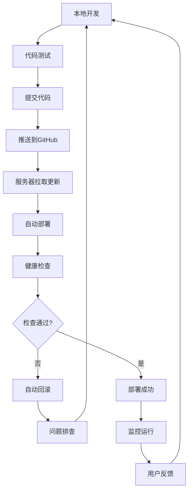

# Lawsker系统代码更新工作流程

## 概述

本文档详细说明了Lawsker系统基于Git的代码更新工作流程，包括开发、测试、部署的完整流程，以及日常维护和bug修复的标准操作程序。

## 工作流程图



## 开发环境设置

### 1. 克隆项目

```bash
# 克隆项目到本地
git clone https://github.com/ronalzhang/lawsker.git
cd lawsker

# 设置上游仓库（如果是fork的项目）
git remote add upstream https://github.com/ronalzhang/lawsker.git
```

### 2. 环境配置

```bash
# 后端环境
cd backend
python3 -m venv venv
source venv/bin/activate
pip install -r requirements-dev.txt

# 前端环境
cd ../frontend-vue
npm install

cd ../frontend-admin
npm install
```

### 3. 开发分支管理

```bash
# 创建功能分支
git checkout -b feature/user-login-fix
git checkout -b hotfix/payment-bug
git checkout -b release/v1.2.0

# 分支命名规范
# feature/功能名称    - 新功能开发
# hotfix/问题描述     - 紧急bug修复
# release/版本号      - 版本发布
# docs/文档类型       - 文档更新
```

## 日常开发流程

### 1. 开始新功能开发

```bash
# 切换到主分支并拉取最新代码
git checkout main
git pull origin main

# 创建功能分支
git checkout -b feature/new-feature-name

# 开始开发...
```

### 2. 代码提交规范

使用约定式提交（Conventional Commits）格式：

```bash
# 提交格式
git commit -m "type(scope): description"

# 类型说明
feat:     新功能
fix:      bug修复
docs:     文档更新
style:    代码格式调整
refactor: 代码重构
test:     测试相关
chore:    构建过程或辅助工具的变动

# 示例
git commit -m "feat(auth): 添加用户登录功能"
git commit -m "fix(payment): 修复支付回调处理bug"
git commit -m "docs(api): 更新API文档"
```

### 3. 代码推送和合并

```bash
# 推送功能分支
git push origin feature/new-feature-name

# 创建Pull Request（在GitHub上）
# 代码审查通过后合并到main分支

# 删除本地功能分支
git branch -d feature/new-feature-name
```

## 生产部署流程

### 1. 使用自动化脚本部署

```bash
# 方式1: 完整的提交和部署流程
./scripts/commit-and-deploy.sh "fix: 修复用户登录问题"

# 方式2: 仅提交代码
./scripts/commit-and-deploy.sh commit "feat: 添加新功能"

# 方式3: 仅部署（代码已提交）
./scripts/commit-and-deploy.sh deploy-only

# 方式4: 快速部署（跳过验证）
./scripts/commit-and-deploy.sh quick "hotfix: 紧急修复"
```

### 2. 手动部署流程

```bash
# 1. 提交并推送代码
git add .
git commit -m "fix: 修复bug"
git push origin main

# 2. 登录服务器
ssh root@your-server-ip

# 3. 更新代码
cd /root/lawsker
./scripts/git-update.sh update

# 4. 检查服务状态
./scripts/git-update.sh status
```

### 3. 部署配置

在使用自动化脚本前，需要配置服务器信息：

```bash
# 编辑部署脚本
vim scripts/commit-and-deploy.sh

# 修改以下配置
REMOTE_SERVER="your-server-ip"      # 服务器IP
REMOTE_USER="root"                  # 用户名
DEPLOY_DIR="/root/lawsker"          # 部署目录
```

## Bug修复流程

### 1. 紧急Bug修复

```bash
# 1. 创建hotfix分支
git checkout main
git pull origin main
git checkout -b hotfix/critical-bug-fix

# 2. 修复bug并测试
# ... 修复代码 ...

# 3. 提交修复
git add .
git commit -m "hotfix: 修复关键支付bug"

# 4. 快速部署
./scripts/commit-and-deploy.sh quick "hotfix: 修复关键支付bug"

# 5. 合并到主分支
git checkout main
git merge hotfix/critical-bug-fix
git push origin main
git branch -d hotfix/critical-bug-fix
```

### 2. 常规Bug修复

```bash
# 1. 创建修复分支
git checkout -b fix/user-profile-update

# 2. 修复并测试
# ... 修复代码 ...

# 3. 提交和部署
./scripts/commit-and-deploy.sh "fix: 修复用户资料更新问题"
```

## 回滚操作

### 1. 自动回滚

更新脚本会在部署失败时自动回滚：

```bash
# 更新失败时的输出示例
[ERROR] 后端服务健康检查失败
[ERROR] 部署失败，开始回滚...
[INFO] 已回滚到备份: lawsker-backup-20240730-1200
[INFO] 服务已重启
```

### 2. 手动回滚

```bash
# 方式1: 回滚到上一个提交
ssh root@your-server-ip
cd /root/lawsker
git reset --hard HEAD~1
systemctl restart lawsker-backend

# 方式2: 回滚到指定提交
git log --oneline -10  # 查看提交历史
git reset --hard <commit-hash>
systemctl restart lawsker-backend

# 方式3: 使用备份回滚
ls /root/lawsker-backups/
rm -rf /root/lawsker
cp -r /root/lawsker-backups/lawsker-backup-20240730-1200 /root/lawsker
systemctl restart lawsker-backend
```

## 版本发布流程

### 1. 准备发布

```bash
# 1. 创建发布分支
git checkout main
git pull origin main
git checkout -b release/v1.2.0

# 2. 更新版本号
# 更新 package.json, __init__.py 等文件中的版本号

# 3. 更新CHANGELOG
vim CHANGELOG.md
```

### 2. 发布版本

```bash
# 1. 提交版本更新
git add .
git commit -m "chore: 发布版本 v1.2.0"

# 2. 合并到主分支
git checkout main
git merge release/v1.2.0

# 3. 创建标签
git tag -a v1.2.0 -m "Release version 1.2.0"
git push origin main
git push origin v1.2.0

# 4. 部署到生产环境
./scripts/commit-and-deploy.sh deploy-only

# 5. 清理发布分支
git branch -d release/v1.2.0
```

## 监控和维护

### 1. 日常监控

```bash
# 检查系统状态
./scripts/commit-and-deploy.sh status

# 查看服务日志
ssh root@your-server-ip
journalctl -u lawsker-backend -f
tail -f /var/log/nginx/access.log
```

### 2. 性能监控

```bash
# 服务器资源监控
ssh root@your-server-ip
htop
df -h
free -h

# 应用性能监控
curl http://your-domain.com/health
curl -w "@curl-format.txt" -o /dev/null -s http://your-domain.com/
```

### 3. 定期维护

```bash
# 每周执行的维护任务
ssh root@your-server-ip

# 清理日志
find /var/log -name "*.log" -mtime +7 -delete

# 清理旧备份
cd /root/lawsker-backups
ls -t | tail -n +10 | xargs -r rm -rf

# 更新系统包
yum update -y  # CentOS
# 或
apt update && apt upgrade -y  # Ubuntu

# 重启服务（如需要）
systemctl restart lawsker-backend
```

## 故障排除

### 1. 常见问题诊断

```bash
# 服务无法启动
systemctl status lawsker-backend
journalctl -u lawsker-backend -n 50

# 前端页面无法访问
nginx -t
systemctl status nginx
curl -I http://localhost/

# 数据库连接问题
# psql -h localhost -U username -d lawsker
```

### 2. 日志分析

```bash
# 应用错误日志
grep -i error /var/log/lawsker-*.log | tail -20

# Nginx访问日志分析
tail -f /var/log/nginx/access.log | grep -E "(4[0-9]{2}|5[0-9]{2})"

# 系统资源问题
dmesg | tail -20
iostat 1 5
```

### 3. 紧急恢复

```bash
# 服务完全无法访问时的恢复步骤

# 1. 检查服务状态
systemctl status lawsker-backend nginx

# 2. 重启所有服务
systemctl restart lawsker-backend
systemctl restart nginx

# 3. 如果仍有问题，回滚到最近的备份
cd /root/lawsker-backups
LATEST_BACKUP=$(ls -t | head -n 1)
rm -rf /root/lawsker
cp -r $LATEST_BACKUP /root/lawsker
systemctl restart lawsker-backend

# 4. 通知相关人员
echo "系统已回滚到 $LATEST_BACKUP" | mail -s "紧急回滚通知" admin@example.com
```

## 最佳实践

### 1. 代码质量

```bash
# 提交前检查
# 1. 运行测试
cd backend && python -m pytest
cd frontend-vue && npm run test

# 2. 代码格式化
cd backend && black . && isort .
cd frontend-vue && npm run lint:fix

# 3. 类型检查
cd backend && mypy .
cd frontend-vue && npm run type-check
```

### 2. 安全实践

```bash
# 1. 定期更新依赖
cd backend && pip-audit
cd frontend-vue && npm audit

# 2. 环境变量管理
# 不要在代码中硬编码敏感信息
# 使用 .env 文件管理配置

# 3. 访问控制
# 定期检查服务器访问权限
# 使用SSH密钥而非密码登录
```

### 3. 文档维护

```bash
# 1. 及时更新文档
# 功能变更时同步更新API文档
# 部署流程变化时更新部署文档

# 2. 记录重要变更
# 在CHANGELOG.md中记录版本变更
# 在README.md中更新使用说明

# 3. 代码注释
# 复杂逻辑添加详细注释
# API接口添加完整的文档字符串
```

## 团队协作

### 1. 分支策略

```bash
# 主分支保护
# main分支只接受PR合并
# 禁止直接推送到main分支

# 功能开发
# 每个功能使用独立分支
# 完成后通过PR合并

# 代码审查
# 所有PR必须经过代码审查
# 至少需要一个审查者批准
```

### 2. 沟通协作

```bash
# 1. 提交信息规范
# 使用清晰的提交信息
# 包含相关的issue编号

# 2. 问题跟踪
# 使用GitHub Issues跟踪bug和功能请求
# 及时更新issue状态

# 3. 文档共享
# 重要决策记录在文档中
# 定期同步团队成员
```

通过遵循这个工作流程，可以确保Lawsker系统的稳定开发和可靠部署，提高团队协作效率和代码质量。